# vbx — Design Document

**A native macOS implementation of `bv` (Beads Viewer)**

| Field | Value |
|---|---|
| **Document** | Architecture & design specification |
| **Status** | Implemented — every capability in this document is built and tested, including git correlation, time travel, recipes, sprints, multi-repository workspaces, static-site export and full robot-protocol parity. Agreement with `bv` is checked by `scripts/parity-check.py` rather than asserted. See [FEATURE_PARITY.md](FEATURE_PARITY.md). |
| **Date** | 2026-08-19 (status refreshed 2026-08-20) |
| **Upstream reference** | [`Dicklesworthstone/beads_viewer`](https://github.com/Dicklesworthstone/beads_viewer) (`bv`) |
| **Target platform** | macOS 14 Sonoma and later, Apple silicon + Intel (universal 2) |
| **Companion document** | [Feature Parity Matrix](FEATURE_PARITY.md) |

---

## 1. Summary

`bv` is a terminal UI (TUI) for **beads** issue graphs: it reads a `.beads/issues.jsonl`
or `beads.db` store, builds a dependency DAG, computes nine graph-theoretic metrics over
it, correlates beads with git history, and presents around twenty distinct views plus a
JSON "robot protocol" for AI agents. It is roughly **85,000 lines of Go**, of which about
**34,000 lines are Bubble Tea terminal UI** and the remaining **~50,000 lines are
platform-neutral engine** (loading, graph analysis, correlation, search, export).

`vbx` delivers the same functionality as a **native macOS application** — SwiftUI/AppKit,
document-based, multi-window, fully keyboard- and menu-driven, with real hit-testable
graph rendering, native tables, Swift Charts dashboards, Quick Look, Spotlight, and
Shortcuts integration.

**The central architectural decision** is that `vbx` **reuses `bv`'s Go engine verbatim**,
compiled as a static library and packaged as an XCFramework, and replaces only the
terminal UI layer. This buys exact numerical parity with upstream, keeps the ~50k lines of
hard-won analysis logic in one place, and lets `vbx` track upstream releases by bumping a
submodule instead of re-deriving algorithms. See [§4](#4-architecture-decision-how-vbx-gets-its-engine).

---

## 2. What `bv` Does — Functional Inventory

Everything below is inherited scope. The [Feature Parity Matrix](FEATURE_PARITY.md) tracks
each item to a concrete `vbx` surface.

### 2.1 Data layer

- **Sources:** `.beads/issues.jsonl` → `beads.jsonl` → `beads.base.jsonl` discovery order;
  SQLite (`beads.db`) via a read-only reader; `bd` workspace layouts; `BEADS_DIR` override.
- **Tolerant parsing:** UTF-8 BOM stripping, 10 MB max line size, malformed lines skipped
  with warnings, legacy field aliases (`depends_on`, `target_id` → `depends_on_id`),
  comment IDs accepted as UUIDv7 string *or* legacy integer.
- **Multi-repo workspaces:** `.bv/workspace.yaml`, repo auto-discovery, ID namespacing by
  prefix, cross-repository dependency edges, per-repo filtering.
- **Live reload:** fsnotify-based watcher with debouncing, polling fallback for
  NFS/SMB/SSHFS, background snapshot worker (opt-in in `bv`).
- **Snapshots and time travel:** load bead state as of an arbitrary git revision, diff two
  snapshots, badge issues `[NEW]` `[CLOSED]` `[MODIFIED]` `[REOPENED]`.

### 2.2 Analysis engine

Two-phase, size-aware, cache-backed:

| Phase | Metrics | Budget |
|---|---|---|
| **Phase 1** (synchronous, must be instant) | in/out degree, topological order, density, node/edge counts | < 50 ms |
| **Phase 2** (async, per-metric timeouts) | PageRank, betweenness (exact or sampled), HITS hubs/authorities, eigenvector, critical-path depth and slack, cycle detection (Tarjan SCC), k-core, articulation points | 500 ms default per metric, size-adjusted |

Every Phase-2 metric carries a **status entry** — `computed` / `approx` / `timeout` /
`skipped` — with elapsed milliseconds and a reason, so consumers can tell a real zero from
a missing value. Results are memoised against a SHA-256 **data hash** of the sorted issue
set; unchanged input skips recomputation entirely.

Derived products layered on those metrics: composite **impact/triage scoring**
(PageRank 30 %, betweenness 30 %, blocker ratio 20 %, staleness 10 %, priority 10 %),
**execution plans** (actionable set + unblocks + parallel tracks from connected
components), **priority recommendations** with confidence, **ETA forecasting** and capacity
simulation, **label health scores**, **cross-label flow matrix** with bottleneck scores,
**attention ranking**, **alerts**, **drift vs. baseline**, **duplicate and dependency
suggestions**, **what-if analysis**, and **risk scoring**.

### 2.3 Git correlation

`pkg/correlation` (~11k LOC) links beads to commits via explicit references, co-commit
patterns, file-path overlap, and temporal proximity; scores each link with a confidence
value; supports user feedback (confirm/reject) that adjusts future confidence; detects
orphan commits; builds an impact network with clusters; performs causal-chain analysis;
and maintains incremental per-commit disk caches so re-analysis is cheap.

Optional **cass** integration correlates AI coding-agent sessions with beads.

### 2.4 Views (terminal)

List · Kanban board · dependency graph · parent–child tree · insights dashboard (6 panels
with calculation proofs) · actionable plan (parallel tracks) · flow matrix · attention view ·
label dashboard · sprint dashboard with burndown · history view with timeline · alerts
panel · recipe picker · label picker · repo picker · semantic search · shortcuts sidebar ·
interactive tutorial · time-travel mode · update modal · agent-prompt modal · cass session
modal.

### 2.5 Outputs

- **Robot protocol:** around 45 `--robot-*` flags emitting stable JSON (plus TOON
  token-optimised encoding) for AI agents, each payload carrying the data hash and config
  for verification.
- **Markdown reports** with embedded Mermaid diagrams.
- **Interactive HTML graph** (self-contained, force-graph based).
- **Static site bundle** with SQLite payload and an optional Rust/WASM hybrid search scorer.
- **Graph snapshots** as SVG/PNG.
- **Shell script emission**, agent brief bundles, GitHub Pages / Cloudflare deploy flows.
- **Hooks:** user-defined commands fired around export phases.

---

## 3. Goals and Non-Goals

### 3.1 Goals

1. **Functional parity** with `bv` — every view, every metric, every export, every robot
   command, reachable from `vbx`.
2. **Numerical parity** — a metric shown in `vbx` is identical to the same metric in `bv`
   for the same input. This is testable and will be tested ([§16](#16-testing-strategy)).
3. **Native, not a port.** Real `NSWindow` documents, native tables with column sorting and
   drag, an Inspector sidebar, the standard menu bar, system-wide keyboard customisation,
   Dark Mode, and VoiceOver.
4. **Faster than the terminal where a GUI can be.** GPU-accelerated graph rendering with
   real pan/zoom/hit-testing; 10k+ issue lists at 120 Hz on ProMotion.
5. **Track upstream cheaply.** A `bv` release should be absorbable in hours, not weeks.
6. **Agent-friendly.** The robot protocol stays available from a CLI, and additionally as
   App Intents (Shortcuts) and a URL scheme.

### 3.2 Non-Goals

1. **Not an editor.** `vbx` reads bead stores and shells out to `bd`/`br` for mutations,
   exactly as `bv` does. Write support is a future, separately designed capability
   ([§20](#20-open-questions)).
2. **Not cross-platform.** iOS/iPadOS are out of scope for v1, though the engine and model
   layers would carry over.
3. **Not a terminal emulator.** `vbx` does not reproduce the TUI's character-cell layouts;
   it reproduces their *meaning* with native controls.
4. **No new analysis.** v1 adds no metrics `bv` does not have.

---

## 4. Architecture Decision: How `vbx` Gets Its Engine

### 4.1 The options

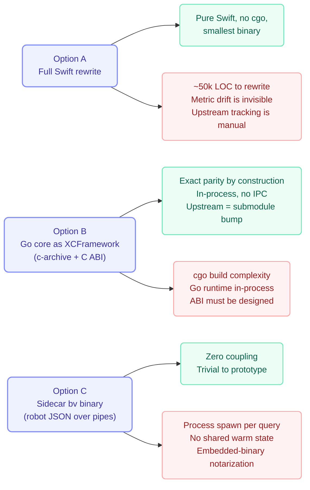

### 4.2 Decision

> **Adopt Option B.** Compile `bv`'s non-UI packages into a static library with
> `go build -buildmode=c-archive`, wrap it in an XCFramework (`BeadsEngine.xcframework`),
> and build a fully native SwiftUI/AppKit front end against it.
>
> **Use Option C as the Phase-0 scaffold** so UI work can start on day one against the real
> `bv` binary, behind the same Swift protocol the XCFramework will later implement.

**Rationale.**

- The value of `bv` is concentrated in `pkg/analysis`, `pkg/correlation`, `pkg/search`,
  `pkg/loader`, and `pkg/export` — about 40k lines whose behaviour is subtle (approximation
  thresholds, timeout semantics, confidence blending, cache-key derivation). Reimplementing
  that in Swift is a multi-quarter effort whose bugs would surface as *plausible but wrong
  numbers*, the worst failure mode for a decision-support tool.
- The layer that genuinely must be rewritten — `pkg/ui`, 34k lines of Bubble Tea — is
  exactly the layer we are replacing on purpose.
- `bv`'s dependencies are cgo-friendly: `gonum` is pure Go, and `modernc.org/sqlite` is a
  pure-Go SQLite with no `libsqlite3` linkage, so the archive is self-contained.
- Upstream `bv` ships frequently (a 56 KB CHANGELOG). A submodule bump plus a bridge smoke
  test is a far cheaper cadence than chasing algorithm changes by hand.

**Accepted costs and mitigations.**

| Cost | Mitigation |
|---|---|
| cgo required; two-arch builds | One `make engine` target produces both slices and `lipo`s them; cached in CI |
| Go runtime lives in-process (~3 MB, own GC, own threads) | Acceptable for a desktop app; measured in the perf budget ([§15](#15-performance-budget)) |
| Go runtime installs signal handlers that can interact with crash reporters | Initialise the archive early, before any Swift crash-reporter install; validate crash symbolication in CI |
| No cross-ABI dead-code elimination — the archive carries all of `bv`'s engine | Roughly 15–25 MB static archive; strip and measure; small for a Mac app |
| The ABI is hand-written surface area | Keep it *tiny*: one generic `call(method, payload)` entry point plus a binary fast path ([§6](#6-the-engine-bridge)) |

---

## 5. System Architecture

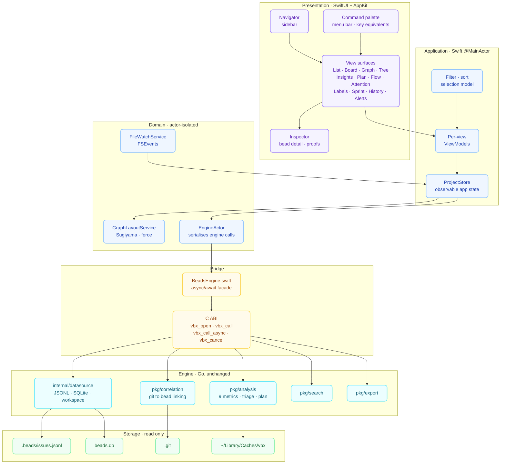

### 5.1 Layer contract

| Layer | Language | Isolation | May depend on |
|---|---|---|---|
| Presentation | Swift / SwiftUI | `@MainActor` | Application |
| Application | Swift | `@MainActor`, `@Observable` | Domain |
| Domain | Swift | `actor` / `Sendable` values | Bridge |
| Bridge | Swift + C | non-isolated, thread-safe | Engine |
| Engine | Go | own scheduler | — |

Dependencies point strictly downward. Nothing in Presentation ever touches the C ABI;
nothing in the Engine knows a UI exists.

### 5.2 Package layout

```
vbx/
├── Engine/                       # Go submodule + build scripts
│   ├── vendor-bv/                # git submodule → beads_viewer
│   ├── bridge/                   # Go package exporting the C ABI (//export)
│   └── Makefile                  # → BeadsEngine.xcframework
├── Packages/
│   ├── BeadsEngineKit/           # C ABI wrapper, async facade, JSON/binary codecs
│   ├── BeadsModel/               # Sendable value types, decoding, formatting
│   ├── BeadsGraphKit/            # layout algorithms, spatial index, Canvas/Metal renderer
│   ├── BeadsUI/                  # shared views, theming, design tokens, chart styles
│   └── BeadsFeatures/            # one module per view surface
├── App/
│   ├── vbx/                      # the macOS app target
│   └── vbx-cli/                  # CLI target (robot protocol parity)
└── docs/
```

---

## 6. The Engine Bridge

### 6.1 C ABI

Deliberately minimal — one open/close pair, one synchronous call, one asynchronous call
with cancellation, and a free.

```c
typedef struct VbxHandle VbxHandle;          // opaque session
typedef struct { uint8_t *ptr; int64_t len; } VbxBuf;

// Lifecycle. config_json selects data source, workspace, cache dir, limits.
VbxHandle *vbx_open(const char *config_json, VbxBuf *err_out);
void       vbx_close(VbxHandle *h);

// Synchronous request/response. Returns 0 on success, non-zero error code.
int32_t    vbx_call(VbxHandle *h,
                    const char *method,       // e.g. "insights", "triage", "plan"
                    const uint8_t *req, int64_t req_len,
                    VbxBuf *out);             // caller frees with vbx_free

// Asynchronous: returns a token immediately; the process-wide callback fires on
// progress, completion, or cancellation.
int64_t    vbx_call_async(VbxHandle *h, const char *method,
                          const uint8_t *req, int64_t req_len);
int32_t    vbx_cancel(int64_t token);

typedef void (*VbxCallback)(int64_t token, int32_t code,
                            const uint8_t *payload, int64_t len);
void       vbx_set_callback(VbxCallback cb);

void       vbx_free(VbxBuf *buf);
```

**Why one generic `method` string rather than 45 typed entry points:** the robot protocol
already defines a stable, versioned, tested request/response vocabulary. Reusing it means
the bridge surface never grows when `bv` gains a feature — a new `bv` robot command becomes
callable from `vbx` with no C, no Go, and no build change.

### 6.2 Memory ownership

- Go allocates every response buffer with `C.malloc` and hands ownership to Swift.
- Swift copies into `Data` or decoded values, then calls `vbx_free` in a `defer`. This is
  enforced by wrapping every call site in a single `withEngineBuffer { … }` helper, so no
  call path can forget.
- Swift-owned request buffers are valid only for the duration of the call; the Go side
  copies before returning from `vbx_call_async`.

### 6.3 Threading and cancellation

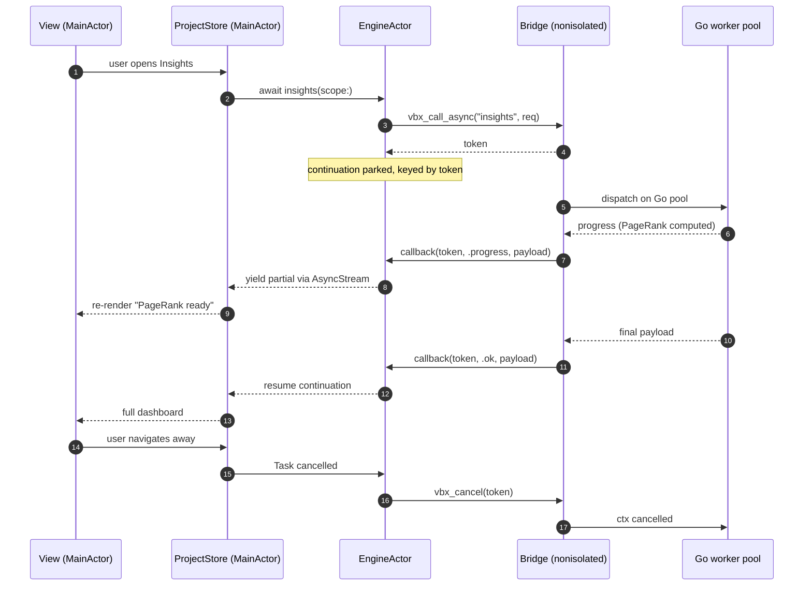

- Swift never blocks the main thread on the engine. `EngineActor` serialises access to a
  single `VbxHandle`; concurrency happens inside Go, where the existing worker pools and
  `errgroup` usage already live.
- The C callback is a `@convention(c)` free function. It cannot capture Swift context, so it
  looks up the token in a lock-protected registry and resumes the parked
  `CheckedContinuation` — or feeds an `AsyncStream` for progress-bearing calls.
- Swift structured-concurrency cancellation maps to `vbx_cancel`, which cancels the Go
  `context.Context`. This is how the two-phase analyser's per-metric deadlines stay honest
  when the user closes a window mid-computation.

### 6.4 Payload encoding

Two codecs behind one Swift API:

| Payload | Codec | Why |
|---|---|---|
| Structured results (triage, plan, insights, alerts, forecast, history…) | **JSON**, the exact robot schema | Free parity testing: the same bytes `bv --robot-triage` emits |
| Bulk issue arrays, per-node metric vectors, graph edge lists | **Packed columnar binary** | 10k issues as JSON is tens of MB; a columnar blob decodes far faster with much less transient allocation |

The binary path is an optimisation, not a semantic fork: it is generated from the same Go
structs and validated in CI to round-trip identically to the JSON form. Ship JSON first and
enable the binary path only where profiling shows it matters ([§15](#15-performance-budget)).

### 6.5 Error model

Go returns `(code, message, detail_json)`. Swift maps codes to a `BeadsEngineError` enum
with cases the UI can act on distinctly: `sourceNotFound`, `parseWarnings([Warning])`,
`metricTimeout(metric:)`, `cancelled`, `workspaceMisconfigured`, `gitUnavailable`,
`internalPanic`. A Go panic inside the archive is recovered at the ABI boundary and
surfaced as `internalPanic` with the goroutine dump attached to a diagnostics report — it
must never take the app down.

---

## 7. Data Model

`BeadsModel` mirrors `bv`'s `pkg/model` as Swift value types. Decoding is lenient in exactly
the places `bv` is lenient, so the two agree on what a malformed file means.

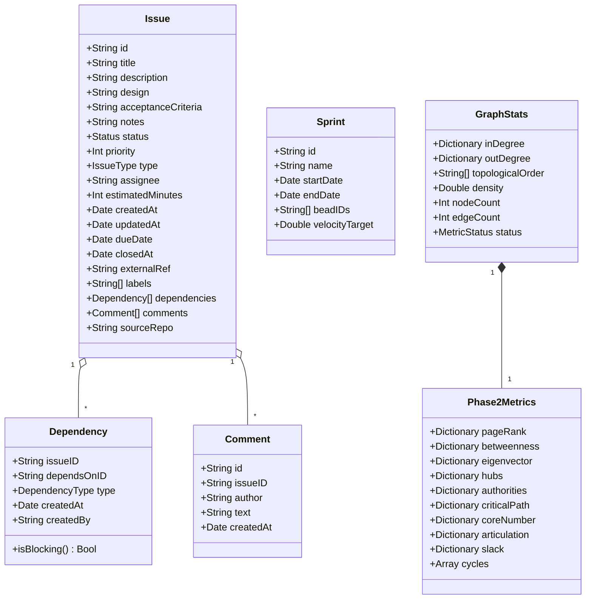

**Design notes.**

- `Status` is a `RawRepresentable` enum with `bv`'s cases (`open`, `in_progress`, `blocked`,
  `deferred`, `draft`, `pinned`, `hooked`, `review`, `closed`, `tombstone`) **plus an
  `unknown(String)` case** — beads is an evolving ecosystem and an unrecognised status must
  render, not crash.
- `IssueType` likewise: the five known types get icons and sort weights; anything else is
  valid and renders with a default icon, matching `bv`'s `IsValid()` / `IsKnownType()` split
  (which exists to accommodate Gastown types like `role`, `agent`, `molecule`).
- `DependencyType.isBlocking` preserves the legacy quirk that an **empty type means
  blocking**. Getting this wrong silently changes every downstream metric.
- All model types are `Sendable` value types so they cross actor boundaries freely.
- Metric maps are stored keyed by issue ID for API fidelity, but hot paths keep a parallel
  dense `[Double]` indexed by a stable node index, built once per snapshot.

---

## 8. Data Loading, Watching, and Time Travel

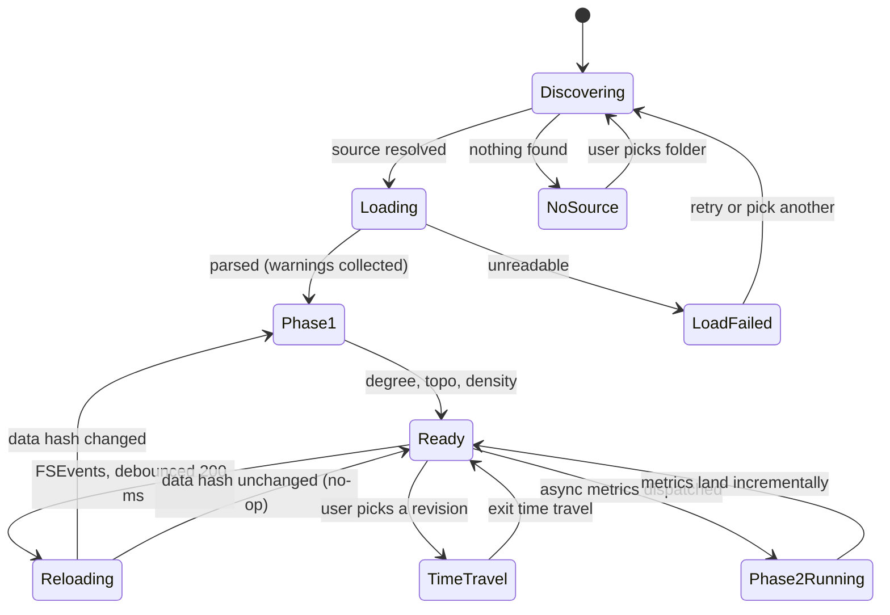

Discovery order is `issues.jsonl` → `beads.jsonl` → `beads.base.jsonl` → `beads.db`, with
backups, merge artefacts, and deletion manifests skipped. Time travel loads a snapshot from
the git object store and diffs it against the current state, producing per-issue badges:
`NEW`, `CLOSED`, `MODIFIED`, `REOPENED`.

### 8.1 Source selection

`vbx` is a **document-based app**: a "document" is a bead workspace (a directory containing
`.beads/`, or a `.bv/workspace.yaml`). This gives recent-documents, window restoration,
drag-and-drop onto the Dock icon, and `open` from the CLI for free.

Discovery order and the `BEADS_DIR` override are delegated to the Go engine so the rules
cannot drift from `bv`. `vbx` adds a native folder picker when discovery finds nothing.

### 8.2 File watching

`FileWatchService` uses **FSEvents** rather than kqueue: it coalesces at directory level,
survives atomic-rename writes (which is how `bd` rewrites JSONL), and is cheap. A 200 ms
debounce matches `BV_DEBOUNCE_MS`. Network volumes are detected via `getattrlist` and fall
back to 2 s polling, mirroring `BV_FORCE_POLLING`.

Reload is **hash-gated**: the engine recomputes the data hash and returns "unchanged"
without re-analysing, so an incidental touch does not cost a re-render.

### 8.3 Sandboxing

`vbx` ships **sandboxed** with:

- `com.apple.security.files.user-selected.read-only` — the user grants a workspace folder.
- **Security-scoped bookmarks** persisted per document, so reopening a workspace does not
  re-prompt.
- Git history requires reading `.git`, which is inside the granted folder, so no extra
  entitlement is needed — *provided* correlation reads the object database directly rather
  than spawning `git`. `bv` currently shells out (`pkg/correlation/gitcmd.go`).
  **Decision:** for the sandboxed app, route correlation through a Go path that reads the
  object store directly; keep the subprocess path for `vbx-cli`, which is not sandboxed.
  This is the one place the engine needs an upstream-friendly patch, and it is worth
  contributing back.

---

## 9. Analysis Pipeline in `vbx`

Two-phase analysis maps naturally onto SwiftUI's incremental rendering.

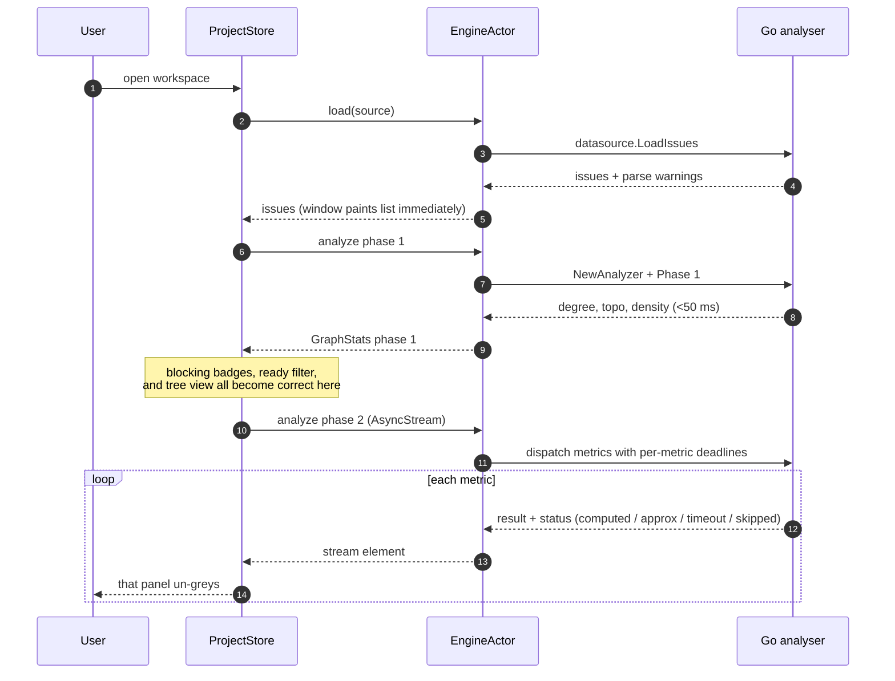

**UI consequences of the phase model — requirements, not niceties:**

- Any view consuming a Phase-2 metric renders a **determinate placeholder carrying the
  metric's status**, never a zero. A `timeout` state shows as "timed out (500 ms)" with a
  "compute anyway" affordance that re-runs without a deadline.
- `approx` metrics (sampled betweenness) are labelled in place with their sample size,
  matching the robot payload's `{"state":"approx","sample":120}`.
- Sorting or filtering by a not-yet-ready metric is disabled rather than silently wrong.
- `bv` fails closed on robot claims when PageRank or betweenness are incomplete
  (`ClaimUnsafeReasons`); `vbx` mirrors this by disabling "claim this bead" actions with the
  same reason text.

---

## 10. User Interface Design

### 10.1 Window anatomy

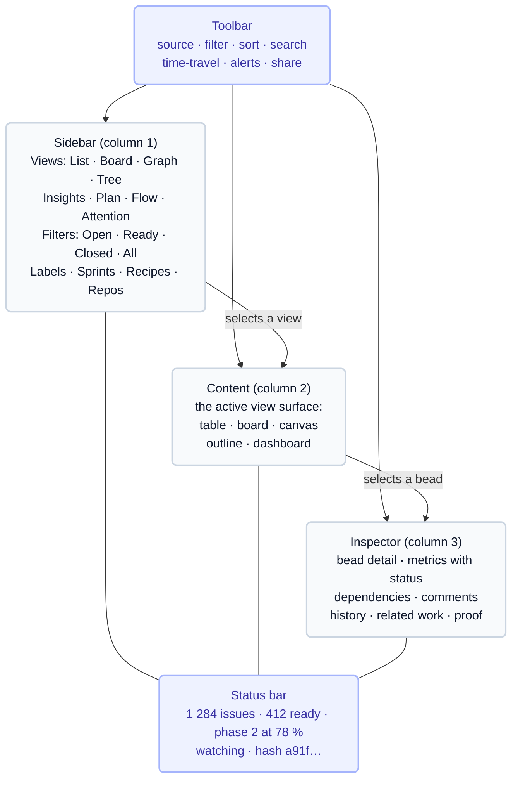

Native affordances that replace TUI mechanics:

| TUI mechanic | `vbx` native equivalent |
|---|---|
| `Tab` to switch focus list ↔ detail | Real focus system; `⌘⌥←/→` moves between panes; the focus ring is visible |
| Shortcuts sidebar (`;`) | Menu bar + a `⌘/` Keyboard Shortcuts sheet + Help-menu search |
| Help overlay (`?`) | Standard Help menu, searchable, with deep links into views |
| Modal pickers (label / recipe / repo) | Command palette (`⌘K`) + sidebar sections + `NSPopover` filters |
| Status-bar indicators | Toolbar status item + window subtitle |
| Character-cell heatmaps | Swift Charts heat maps with real colour scales and tooltips |
| Unicode sparklines | Swift Charts inline area/line marks inside table cells |
| ASCII graph | Hit-testable vector canvas ([§11](#11-graph-rendering)) |

### 10.2 View-by-view mapping

| `bv` view | `vbx` surface | Native technology | Notes |
|---|---|---|---|
| **List** | `Table` with sortable columns | `NSTableView` via `NSViewRepresentable` (`BeadTable`); cell appearance is SwiftUI | Columns: ID, title, status, priority, type, labels, PageRank, blocks, blocked-by, a combined blocked/by, created, updated. Column visibility, order and width persisted. Multi-select. Double-click edits the cell that was clicked (ADR-014). Rows ahead of the last commit are tinted (ADR-015). |
| **Kanban board** | Column-per-status board | `LazyHStack` + `LazyVStack`, drag-and-drop | Four-line rich cards, per-column stats header, inline expansion via disclosure, swimlane grouping (label / assignee / type / epic) as a segmented control |
| **Graph** | Pan/zoom canvas | `BeadsGraphKit`: layered layout + `Canvas`/Metal | See [§11](#11-graph-rendering) |
| **Tree** | Parent–child outline | `OutlineGroup` in a source-list `Table` | Expand/collapse all, keyboard `←/→`, reveal-in-graph |
| **Insights dashboard** | Six-panel grid | `Grid` + Swift Charts | Panel focus with `Tab`; the "calculation proof" becomes an expandable inspector section showing the formula and the actual substituted numbers |
| **Actionable plan** | Track lanes | Board-style lanes, one per parallel track | Each item shows its unblock count and downstream chain |
| **Flow matrix** | Label × label matrix | Swift Charts heat map + drill-down table | Bottleneck-score colour scale; click a cell to filter the list to those edges |
| **Attention view** | Ranked label list | `Table` with score bars | Score decomposition in the inspector |
| **Label dashboard** | Health cards | `Grid` of cards + charts | Health level colour, trend sparkline |
| **Sprint dashboard** | Burndown | Swift Charts line + ideal-line overlay | At-risk banner; velocity comparison chart |
| **History** | Timeline + commit list | `Table` + a custom timeline `Canvas` | Confidence badges, causality markers, file-centric drill-down, Quick Look on diffs |
| **Alerts** | Severity-grouped list | `List` with sections | Optional `UNUserNotificationCenter` delivery for critical alerts while watching |
| **Semantic search** | Unified search field | `.searchable` + scope bar | Fuzzy ↔ semantic toggle; hybrid weights in a popover |
| **Recipes** | Sidebar section + editor | `List` + a form-based recipe editor | Built-in and user recipes; applying one sets filter, sort, and view atomically |
| **Time travel** | Revision scrubber | Toolbar control + diff badges | Scrubber over recent commits; badges tint rows |
| **Tutorial** | Onboarding window | A separate `WindowGroup` with progress | Sections mirror `bv`'s; progress persisted; each view links to "learn this view" |
| **Update modal** | Sparkle | Sparkle 2 | Native, signed, delta updates |
| **Agent prompt / cass modals** | Sheets | SwiftUI sheets | Copy-to-clipboard prompt builder; cass session preview |

### 10.3 Keyboard model

`bv` is vim-keyed; macOS users expect `⌘`-keyed. `vbx` serves both:

- **Every action has a menu item with a standard macOS key equivalent.** This is the
  primary, discoverable path, and it is system-customisable because they are real menu items.
- **A "Terminal keys" mode** (default **on**, toggleable in Settings) additionally binds
  `bv`'s single-key map — `j/k`, `g/G`, `o/r/c/a`, `b/i/g/E/f`, `[`, `]`, `/`, `;`, `!`,
  `'`, `t/T`, `x/C/O` — whenever no text field has focus. Users coming from `bv` keep their
  muscle memory; users who do not, never see it.
- **Command palette** (`⌘K`) exposes every command by name with fuzzy matching, showing both
  bindings side by side. This is what makes the dual model teachable rather than confusing.

Conflicts resolve by focus: a bare letter is a `bv` shortcut only when the first responder
does not accept text.

### 10.4 Visual design and accessibility

- System materials, `.regularMaterial` sidebars, standard vibrancy behaviour.
- Semantic colours only, resolved per appearance from a single `BeadsUI` token set that is
  contrast-checked in light and dark and ships a colour-blind-safe variant — status colour is
  load-bearing on the board and in heat maps, so it cannot be the *only* encoding. Status is
  always also carried by an SF Symbol.
- Full Dark Mode, Increase Contrast, and Reduce Motion support (graph animations degrade to
  cross-fades).
- **VoiceOver:** every chart carries an `accessibilityChartDescriptor`; the graph canvas
  exposes an accessibility element tree of nodes with their dependency relationships as
  custom rotors; the board announces column and position on move.

---

## 11. Graph Rendering

This is the largest capability gap between a TUI and a native app. `bv` draws an ASCII
approximation; `vbx` draws a real, interactive, hit-testable graph.

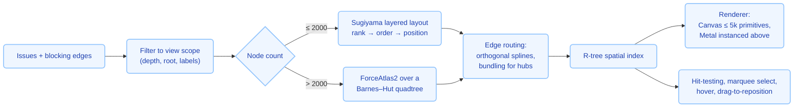

**Decisions.**

- **Layout is computed off the main actor** in `BeadsGraphKit`, in Swift rather than Go —
  this is presentation, and `bv` has no equivalent worth reusing. Layered Sugiyama is the
  right default because the graph *is* a dependency DAG and rank equals topological depth,
  which the engine already computes in Phase 1.
- **Cycles** break layering. Feed the engine's detected cycles in, condense each SCC into a
  super-node for ranking, then expand and draw back-edges in a distinct style. This makes
  the cycle warning *visible* rather than a footnote.
- **Rendering** starts with SwiftUI `Canvas`, which handles a few thousand primitives at
  60–120 Hz. An `MTKView` path with instanced quads and SDF-rendered edges takes over above
  the measured threshold. Both consume the same scene description, so the switch is invisible.
- **Visual encoding** carries the metrics: node radius = PageRank, fill = status, ring =
  betweenness percentile, border = articulation point, opacity = staleness, edge weight =
  criticality. Encoding is user-configurable and always legended.
- **Interaction:** pinch/scroll zoom, drag pan, click select (synced to inspector and list),
  double-click to focus a subgraph, `⌥`-hover to highlight the full transitive blocking set,
  marquee multi-select, isolate, expand-neighbours, and export the current camera to SVG/PNG
  — reusing the engine's snapshot exporter so output matches `bv --export-graph`.

---

## 12. Search

| Mode | `bv` | `vbx` |
|---|---|---|
| **Fuzzy** | Flattened-vector index, subsequence matching | Same engine call; results ranked identically |
| **Semantic** | `hash` embedder by default, pluggable provider, 384 dimensions | Same engine call by default, **plus** an optional on-device embedder using Apple's `NLEmbedding` or a bundled Core ML sentence encoder |
| **Hybrid** | Text + graph-metric weighting, tunable presets | Same, with a weights popover and live re-ranking |

The Core ML embedder is strictly opt-in and clearly labelled, because switching embedders
changes ranking — a parity-relevant behaviour change. The default stays `bv`'s hash embedder
so results match the CLI out of the box.

Search is also wired to **Spotlight**: `vbx` indexes open workspaces into
`CSSearchableIndex`, so a bead ID or title typed into Spotlight opens it directly in `vbx`.

---

## 13. Robot Protocol, CLI, and Automation

Parity here is non-negotiable: `bv` is heavily used *by AI agents*, and a Mac app that drops
that is not a replacement.

Three surfaces, one engine:

1. **`vbx-cli`** — a separate executable target linking the same XCFramework, accepting the
   full `--robot-*` flag set and emitting byte-identical JSON/TOON. Shipped inside the app
   bundle at `Contents/MacOS/vbx-cli`, with an "Install Command Line Tool…" menu item that
   symlinks it into `/usr/local/bin` (the Xcode / `gh` pattern). A CI job diffs
   `vbx-cli --robot-X` against `bv --robot-X` across the fixture corpus.
2. **App Intents / Shortcuts** — `GetTriage`, `GetNextBead`, `GetExecutionPlan`, `GetAlerts`,
   `ForecastBead`, `ExportReport`. This makes `vbx` scriptable from Shortcuts, Spotlight, and
   Siri, and callable from other apps without shelling out.
3. **URL scheme** — `vbx://open?workspace=…&bead=…&view=graph` for deep links from commit
   messages, chat, and agent output.

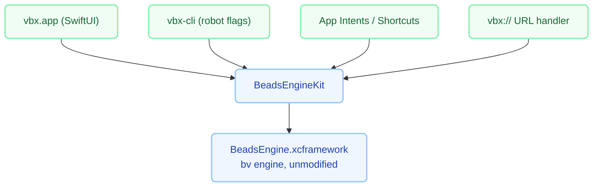

---

## 14. Exports and Sharing

All export formats are produced by the engine's existing `pkg/export`, so output is
identical to `bv`:

- **Markdown report** with Mermaid — `⌘⇧E`, plus a Share-sheet destination.
- **Interactive HTML graph** — self-contained, opens in the default browser.
- **Static site bundle** — the wizard becomes a native multi-step sheet; deploy targets
  (GitHub Pages, Cloudflare) keep their existing flows, with credentials stored in the
  **Keychain** rather than environment variables.
- **SVG/PNG graph snapshots** — additionally available as drag-out from the graph canvas and
  as an `NSSharingService` provider.
- **Hooks** — user shell commands around export phases. In the sandboxed app these run via a
  user-approved `NSUserUnixTask` path or are disabled with an explanation pointing at
  `vbx-cli`; the CLI keeps full hook behaviour.

---

## 15. Performance Budget

Targets measured on an Apple-silicon Mac with a 2 000-issue / 6 000-edge workspace:

| Operation | Target | Strategy |
|---|---|---|
| Cold launch → window visible | < 300 ms | `vbx_open` on a background task; list paints from Phase-1 data |
| Workspace open → first list paint | < 120 ms | Streamed decode; `Table` is lazy |
| Phase-1 metrics | < 50 ms | Inherited from `bv` |
| Phase-2 metrics, all | < 1.5 s, streamed | Inherited; per-metric deadlines; the UI never waits |
| Scroll a 10 000-row table | 120 Hz, no dropped frames | Cell reuse; no per-row engine calls; precomputed display strings |
| Graph layout, 2 000 nodes | < 400 ms off-main | Sugiyama with incremental re-rank on filter change |
| Graph render, pan and zoom | 120 Hz | Canvas → Metal above threshold; R-tree culling |
| Reload after file change | < 150 ms unchanged, < 400 ms changed | Hash gate; incremental analyser cache |
| Memory, 10 000 issues | < 400 MB RSS | Columnar metric storage; Go and Swift each hold one copy, not three |

For context, `bv`'s own measurements put betweenness at roughly 1.3 s for 1 000 nodes and
4.6 s for 2 000 — which is precisely why it is a Phase-2, deadline-bounded, status-reporting
metric, and why the `vbx` UI must be designed to render correctly without it.

Everything is instrumented with `os_signpost` around each engine call and layout pass, so
Instruments traces attribute time to a named phase. A `vbx --profile-startup` mode mirrors
`bv`'s.

---

## 16. Testing Strategy

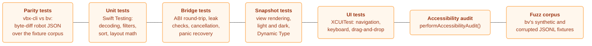

**The parity suite is the backbone.** `bv` already ships `testdata/` and synthetic-data
fuzzing; `vbx` reuses that corpus and asserts that for every fixture and every robot method,
`vbx-cli` output equals `bv` output modulo a documented, enumerated exception list (timing
fields, absolute paths, version strings). Any divergence fails CI. This is what makes "same
functionality" a claim rather than a hope.

Bridge tests run under Address Sanitizer with a leak-checking harness asserting that every
`vbx_call` buffer is freed and that cancelling mid-flight neither leaks nor double-frees.

---

## 17. Build, Packaging, and Distribution

```mermaid
flowchart LR
    classDef b fill:#f5f3ff,stroke:#c4b5fd,stroke-width:2px,color:#5b21b6,rx:6
    SUB["git submodule<br/>beads_viewer @ pinned tag"]:::b --> GOB["go build -buildmode=c-archive<br/>GOOS=darwin,<br/>GOARCH=arm64 and amd64"]:::b
    GOB --> LIPO["lipo → universal .a<br/>+ generated header"]:::b
    LIPO --> XCF["xcodebuild -create-xcframework<br/>→ BeadsEngine.xcframework"]:::b
    XCF --> SPM["SwiftPM binaryTarget"]:::b
    SPM --> APP["xcodebuild archive<br/>→ vbx.app, universal"]:::b
    APP --> SIGN["codesign: Developer ID,<br/>hardened runtime"]:::b
    SIGN --> NOT["notarytool submit + staple"]:::b
    NOT --> DIST["DMG + Sparkle appcast<br/>Homebrew cask<br/>optional Mac App Store"]:::b
```

- **Reproducibility:** the engine build is content-addressed on the submodule SHA plus the Go
  toolchain version and cached in CI, so most builds skip the Go step entirely.
- **Two distribution channels.** Developer ID + Sparkle is primary — it preserves hooks, the
  CLI symlink, and unrestricted git access. A Mac App Store build is possible but must drop
  shell hooks and `/usr/local/bin`; ship it only if there is demand, and gate the affected
  features behind a capability check rather than forking the codebase.
- **Homebrew cask** `vbx`, so `bv` users can `brew install --cask vbx`.

**Status.** Signing and packaging are built: `scripts/package-app.sh` produces a
Developer ID `.dmg` — hardened runtime, notarized, stapled — and a sandboxed
`.pkg` for App Store Connect, both driven from `build-app.sh --release --dmg`
and `--app-store`. The two channels ship deliberately different apps
([ADR-010](project_notes/DECISIONS.md)), and no signing identifier is in this
repository ([ADR-009](project_notes/DECISIONS.md)).

The **universal binary** is built. `build-app.sh --universal` builds the engine
archive for both architectures and asks SwiftPM for both slices of each product,
and every distribution build implies it — an arm64-only `.dmg` excludes every
Intel Mac, and Rosetta is no help because it translates x86_64 to arm64, not the
reverse. The slices are asserted with `lipo -archs` on both binaries in the
bundle rather than inferred from the flag, for the same reason
`assert_archive_target` exists. It roughly doubles the build, so the host-only
build stays the default for development.

The **version** comes from the git tag (`scripts/version.sh`), because
`CFBundleShortVersionString`, the `.dmg` filename and a Homebrew cask's
`version` all have to agree and a literal in one of them is what makes them
drift.

**The release pipeline is built; nothing has been released.** `scripts/release.sh`
tags, builds universal, packages, notarizes, verifies the ticket is stapled,
computes the `sha256` and renders `packaging/homebrew/vbx.rb.template` into a
ready-to-paste cask. What does not exist yet is anything outside this
repository: there is no tagged release, no published `.dmg`, and no
`homebrew-tap` repository — so `brew install --cask vbx` does not work today.
See [ADR-012](project_notes/DECISIONS.md) for why the cask goes to a personal
tap rather than `homebrew/homebrew-cask`.

Not built: the **Sparkle appcast**. The diagram above describes the intended end
state, not today's pipeline — there is no xcframework, and `build-app.sh`
assembles the bundle directly from SwiftPM output rather than through
`xcodebuild archive`.

---

## 18. Delivery Plan

| Phase | Scope | Exit criteria |
|---|---|---|
| **0 — Scaffold** (2 wks) | App shell, document model, `EngineProtocol` implemented by the **subprocess** backend against the real `bv` binary; List view | Open a workspace; see a sorted, filtered, searchable list |
| **1 — Bridge** (3 wks) | Go `c-archive` + C ABI + XCFramework; `EngineProtocol` swapped in-process; async and cancellation; bridge test suite | Subprocess backend deleted; parity suite green for `triage`, `insights`, `plan` |
| **2 — Core views** (4 wks) | Board, Tree, Inspector, filters, sorts, labels, recipes, live reload | Daily-driver replacement for `bv`'s list/board/tree usage |
| **3 — Graph** (4 wks) | `BeadsGraphKit`: layout, Canvas renderer, interaction, cycle handling, SVG/PNG export | 2 000-node graph at 120 Hz with hit-testing |
| **4 — Analytics** (4 wks) | Insights with proofs, Plan, Flow matrix, Attention, Label dashboard, Sprint/burndown, Alerts | All Phase-2 metrics surfaced with correct status semantics |
| **5 — History** (3 wks) | Correlation, timeline, causality, file drill-down, orphans, feedback, cass | History parity with `--robot-history` |
| **6 — Automation** (2 wks) | `vbx-cli` full robot flag set, App Intents, URL scheme, Spotlight | Full parity suite green across all robot methods |
| **7 — Polish and ship** (3 wks) | Time travel, tutorial, exports and wizard, accessibility audit, Sparkle, notarization, cask | Public 1.0 |

Roughly **25 weeks** for one engineer, materially less in parallel — phases 3, 4, and 5 are
independent once phase 1 lands.

---

## 19. Risks

| Risk | Impact | Mitigation |
|---|---|---|
| cgo / `c-archive` friction (signal handlers, crash reporting, static-init order) | High | De-risk with a Phase-1 spike before committing; the Phase-0 subprocess backend remains a working fallback throughout |
| Upstream `bv` refactors its internal packages | Medium | Depend on `pkg/*` public APIs and the robot method vocabulary, not internals; pin a tag; the parity suite catches drift immediately |
| Metric divergence creeping in via convenience reimplementation in Swift | High | **Rule: no metric is ever computed in Swift.** Layout and formatting only. Enforced in review and by the parity suite |
| Sandbox blocks git-subprocess correlation | Medium | Direct object-store reads in the engine ([§8.3](#83-sandboxing)); contribute upstream; the CLI keeps the subprocess path |
| Graph layout quality on dense or cyclic real graphs | Medium | SCC condensation; user-switchable layouts; ship the force layout as an escape hatch |
| Dual keyboard model confuses users | Low | The command palette makes both discoverable; Terminal-keys mode is one switch |
| Binary size from the full Go engine | Low | Measure and strip; this is a desktop app, not an embedded target |

---

## 20. Open Questions

1. **Write support.** `bv` is read-only and shells to `bd`/`br`. Should `vbx` v1 offer inline
   status changes and drag-to-reprioritise on the board by invoking `bd`? It is the first
   thing a GUI user will try. *Recommendation: yes, in v1.1, behind an explicit "enable
   editing" preference, implemented strictly as `bd` invocations so the JSONL stays canonical.*
2. **Multi-window vs. tabs** for multiple workspaces — native tabs come free with `NSWindow`;
   confirm the workspace/document mapping with users of `.bv/workspace.yaml`.
3. **Minimum macOS.** Targeting 14.0 unlocks `@Observable`, `Inspector`, and modern `Table`
   features. Does anyone need 13.0?
4. **Rust/WASM hybrid search scorer** — ship it as `bv` does for static exports, or compile
   that crate natively for the app's own search path?
5. **Telemetry.** `bv` has none. *Recommendation: opt-in crash reports only, no analytics.*

---

## Appendix A — Engine Method Vocabulary

The bridge's `method` strings map one-to-one onto `bv`'s robot commands, which keeps the
surface self-documenting and the parity suite exhaustive:

`triage` · `triage_by_track` · `triage_by_label` · `next` · `plan` · `insights` · `metrics` ·
`priority` · `impact` · `impact_network` · `blocker_chain` · `related` · `causality` ·
`history` · `file_beads` · `file_hotspots` · `file_relations` · `orphans` ·
`explain_correlation` · `confirm_correlation` · `reject_correlation` · `correlation_stats` ·
`search` · `suggest` · `forecast` · `capacity` · `burndown` · `sprint_list` · `sprint_show` ·
`label_health` · `label_flow` · `label_attention` · `alerts` · `drift` · `diff` · `graph` ·
`recipes` · `by_label` · `by_assignee` · `capabilities` · `schema` · `docs`

Plus `vbx`-local methods that are not robot commands: `open`, `close`, `reload`, `data_hash`,
`parse_warnings`, `snapshot_at`, `export_markdown`, `export_graph`, `export_site`.

---

## Appendix B — Glossary

| Term | Meaning |
|---|---|
| **Bead** | A single issue or work item in the beads system |
| **Actionable** | Open or in-progress with no open blocking dependency |
| **Unblocks** | The set of issues that become actionable if this one closes |
| **Track** | A connected component of the actionable subgraph — a parallel work stream |
| **Data hash** | SHA-256 over the sorted issue set; the cache key and the parity anchor |
| **Phase 1 / Phase 2** | Instant vs. asynchronously computed metric tiers |
| **Robot protocol** | `bv`'s stable JSON interface for AI agents |
| **TOON** | Token-optimised output encoding for lower LLM context cost |
| **Drift** | Divergence of current state from a saved baseline |
| **cass** | Coding-agent session search tool; optionally correlated with beads |
